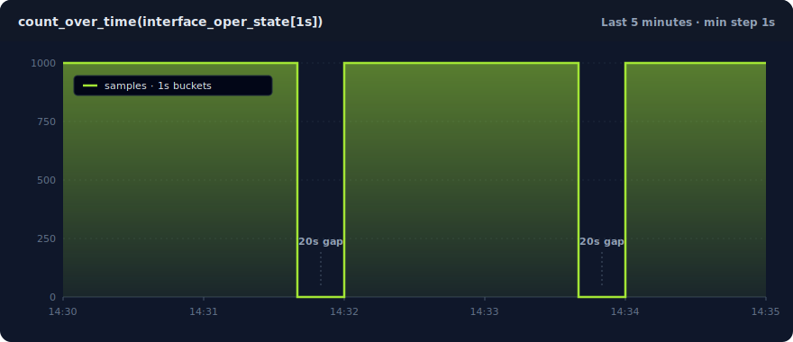

# Scenario Fields

This page is the per-entry field reference. Every field you can set on a `scenarios:` entry inside a [scenario file](../build/scenario-files.md) is listed below, with examples and defaults. The fields cover generators, schedules, labels, encoders, sinks, and multi-scenario timing controls.

!!! info "Start with the file guide"
    For the file shape (`version: 2`, `defaults:`, `scenarios:`), catalog metadata, pack-backed entries, and `after:` temporal chains, see [**Scenario Files**](../build/scenario-files.md). Every field below sits inside a `scenarios:` entry.

## Complete example

A single entry that uses every available field:

```yaml title="full-example.yaml"
version: 2
kind: runnable

defaults:
  rate: 100
  duration: 30s
  encoder:
    type: prometheus_text
    precision: 2          # optional: limit values to 2 decimal places
  sink:
    type: stdout

scenarios:
  - id: cpu_usage
    signal_type: metrics
    name: cpu_usage

    metric_type: gauge
    help: "CPU usage percent on the device."

    generator:
      type: sine
      amplitude: 50.0
      period_secs: 60
      offset: 50.0

    gaps:
      every: 2m
      for: 20s

    bursts:
      every: 10s
      for: 2s
      multiplier: 5.0

    cardinality_spikes:
      - label: pod_name
        every: 2m
        for: 30s
        cardinality: 500
        strategy: counter
        prefix: "pod-"

    dynamic_labels:
      - key: hostname
        prefix: "host-"
        cardinality: 10

    labels:
      zone: us-east-1

    jitter: 2.5
    jitter_seed: 42

    phase_offset: "5s"
    clock_group: alert-test
```

```bash
sonda run full-example.yaml
```

## Field reference

### Core fields

The fields below appear on every `scenarios:` entry, regardless of signal type.

| Field | Type | Required | Default | Description |
|-------|------|----------|---------|-------------|
| `name` | string | yes | -- | Metric name. Must match `[a-zA-Z_:][a-zA-Z0-9_:]*`. |
| `rate` | float | yes | -- | Events per second. Must be positive. Fractional values are allowed (e.g. `0.5`). |
| `duration` | string | no | runs forever | Total run time. Supports `ms`, `s`, `m`, `h` units. |
| `start_time` | string | no | `now` | Timestamp anchor written on every emitted event. Accepts an absolute RFC 3339 timestamp, a signed relative offset (`+24h`, `-7d`), or `now`. See [Timestamp anchor](#timestamp-anchor). |
| `generator` | object | yes | -- | Value generator configuration. Core types and [operational aliases](../build/generators.md#operational-aliases). See [Generators](../build/generators.md). |
| `encoder` | object | no | `prometheus_text` | Output format. See [Encoders](../build/encoders.md). |
| `sink` | object | no | `stdout` | Output destination. See [Sinks](../build/sinks.md). |
| `dynamic_labels` | list | no | none | Rotating labels that cycle through values on every tick. See [Dynamic labels](#dynamic-labels). |
| `labels` | map | no | none | Static key-value labels attached to every event. |
| `jitter` | float | no | none | Noise amplitude. Adds uniform noise in `[-jitter, +jitter]` to every generated value. See [Generators - Jitter](../build/generators.md#jitter). |
| `jitter_seed` | integer | no | `0` | Seed for deterministic jitter noise. Different seeds produce different noise sequences. |
| `on_sink_error` | string | no | `warn` | Behavior when the sink returns an error mid-run. `warn` logs the error, drops the batch, and keeps running. `fail` propagates the error and exits the runner. Overrides `defaults.on_sink_error`. See [Sink-error policy](../build/scenario-files.md#sink-error-policy). |
| `metric_type` | string | no | derived | Prometheus exposition type: `gauge`, `counter`, `histogram`, `summary`, or `untyped`. Appears on the `sonda-server` [`/metrics` endpoints](../deploy/http-api.md#aggregate-prometheus-scrape) as the `# TYPE` line. See [Prometheus exposition fields](#prometheus-exposition-fields). |
| `help` | string | no | none | Free-text description emitted as the `# HELP` line on the `sonda-server` [`/metrics` endpoints](../deploy/http-api.md#aggregate-prometheus-scrape). Omitted when unset. See [Prometheus exposition fields](#prometheus-exposition-fields). |

### Prometheus exposition fields

`metric_type` and `help` annotate a scenario's metric so the `sonda-server` `/metrics` endpoints emit Prometheus `# TYPE` and `# HELP` lines. Both fields apply to `metrics`, `histogram`, and `summary` entries. Log entries ignore them.

These annotations have no effect for the per-event sinks that the `sonda run` CLI uses (`stdout`, `file`, `tcp`, and so on). They exist for scrape-based delivery through [`sonda-server`](../deploy/server.md).

| Field | Type | Required | Default | Description |
|-------|------|----------|---------|-------------|
| `metric_type` | string | no | derived (see below) | One of `gauge`, `counter`, `histogram`, `summary`, `untyped`. |
| `help` | string | no | none | Free-text description. When omitted, no `# HELP` line is emitted. |

**Defaults**, applied when `metric_type` is omitted:

| Signal | Generator | Default `metric_type` |
|--------|-----------|----------------------|
| `metrics` | `step` | `counter` |
| `metrics` | any other generator | `gauge` |
| `histogram` | -- | `histogram` |
| `summary` | -- | `summary` |

```yaml title="Metrics entry with explicit exposition"
scenarios:
  - id: memory_utilization
    signal_type: metrics
    name: memory_utilization
    metric_type: gauge
    help: "Memory usage percent on the device."
    generator:
      type: constant
      value: 41.5
    labels:
      device: srl1
```

Scrape the server and the response carries both annotations:

```text title="GET /metrics"
# HELP memory_utilization Memory usage percent on the device.
# TYPE memory_utilization gauge
memory_utilization{device="srl1"} 41.5
```

!!! info "Why declare `metric_type`?"
    Prometheus-text consumers (Prometheus, VictoriaMetrics, Telegraf, vmagent) treat unannotated metrics as `untyped`. Some downstream tooling renames untyped samples. For example, an untyped metric named `bgp_oper_state` may become `bgp_oper_state_value` after a Telegraf-style relay. Declaring `metric_type:` keeps the metric name stable across every scraping consumer in the chain.

!!! warning "Mixed-type collisions become `untyped`"
    Prometheus allows only one `# TYPE` line per metric name. Suppose two scenarios share a `name:` but declare different `metric_type` values, one `gauge` and one `counter`. The aggregate [`GET /metrics`](../deploy/http-api.md#aggregate-prometheus-scrape) emits a single `# TYPE <name> untyped` block containing samples from both, and logs a server-side warning. Use a consistent `metric_type` per metric name to avoid this.

### Gap window

Gaps create recurring silent periods where no events are emitted. Both fields must be provided together.

| Field | Type | Required | Description |
|-------|------|----------|-------------|
| `gaps.every` | string | yes (if gaps used) | Recurrence interval (e.g. `"2m"`). |
| `gaps.for` | string | yes (if gaps used) | Duration of each gap. Must be less than `every`. |

```yaml title="Gap example"
gaps:
  every: 2m
  for: 20s
```

This emits events for 1m40s, then is silent for 20s, then repeats.

!!! tip "Checking gaps in Prometheus or Grafana"
    Gaps are visually hard to see at default settings. Two common pitfalls catch first-time users:

    - **Instant queries**: `interface_oper_state` in the Prometheus expression bar uses a 5-minute `lookback_delta`. A series that stopped emitting 10 seconds ago still appears "live" for up to 5 minutes. A 20-second gap is *invisible* at the default settings.
    - **Auto step size**: `present_over_time(interface_oper_state[5s])` over a 5-minute range is evaluated at ~30-second steps in Grafana Explore. A 4-minute run with 240k samples collapses to ~7 dots on the graph. The data is there. The *evaluation cadence* hid it.

    To see the duty cycle, use this query in **Grafana Explore**:

    ```promql
    count_over_time(interface_oper_state[1s])
    ```

    With these panel settings:

    - **Min step**: `1s` (otherwise Grafana picks a larger step and the gaps blur together)
    - **Time range**: `Last 5 minutes` (shows two full cycles of the example below)
    - **View**: Time series (default)

    

    *Above: `count_over_time(interface_oper_state[1s])` against [`examples/basic-metrics.yaml`](https://github.com/davidban77/sonda/blob/main/examples/basic-metrics.yaml). The example declares `rate: 1000` and `gaps: every: 2m for: 20s`. You see ~100s of ~1000 samples/sec, then 20s of zero, repeating.*

    Why every x-axis point is honest data: `count_over_time(...[1s])` groups samples into 1-second windows and returns `0` for empty windows (not null). No connect-null-values toggle is needed. With a 1-second min step, Grafana evaluates once per second, so one window maps to one x-axis point. What you see is what arrived.

    The same approach works for `bursts:` (the rate rises during a burst window) and for any other rate-shaping field. The rule: when checking short-window behavior, set your evaluation step *below* the window you want to see.

### Burst window

Bursts create recurring high-rate periods. All three fields must be provided together. If a gap and a burst overlap, the gap takes priority.

| Field | Type | Required | Description |
|-------|------|----------|-------------|
| `bursts.every` | string | yes (if bursts used) | Recurrence interval (e.g. `"10s"`). |
| `bursts.for` | string | yes (if bursts used) | Duration of each burst. Must be less than `every`. |
| `bursts.multiplier` | float | yes (if bursts used) | Rate multiplier during burst. Must be positive. |

```yaml title="Burst example"
bursts:
  every: 10s
  for: 2s
  multiplier: 5.0
```

At a base rate of 100 events/sec, this produces 500 events/sec for 2 seconds out of every 10.

### Cardinality spike window

Cardinality spikes inject dynamic label values during recurring windows. They reproduce the label explosions that break real pipelines. During a spike window, a configured label key is added with one of `cardinality` unique values. Outside the window, the label is absent.

| Field | Type | Required | Default | Description |
|-------|------|----------|---------|-------------|
| `cardinality_spikes[].label` | string | yes | -- | Label key to inject during the spike. |
| `cardinality_spikes[].every` | string | yes | -- | Recurrence interval (e.g. `"2m"`). |
| `cardinality_spikes[].for` | string | yes | -- | Duration of each spike. Must be less than `every`. |
| `cardinality_spikes[].cardinality` | integer | yes | -- | Number of unique label values. Must be > 0. |
| `cardinality_spikes[].strategy` | string | no | `counter` | Value generation strategy: `counter` or `random`. |
| `cardinality_spikes[].prefix` | string | no | `"{label}_"` | Prefix for generated label values. |
| `cardinality_spikes[].seed` | integer | no | `0` | RNG seed for the `random` strategy. |

```yaml title="Cardinality spike example"
cardinality_spikes:
  - label: pod_name
    every: 2m
    for: 30s
    cardinality: 500
    strategy: counter
    prefix: "pod-"
```

**Strategies:**

- **`counter`** — Generates sequential values: `{prefix}0`, `{prefix}1`, ..., `{prefix}{cardinality-1}`, then wraps around. Deterministic without a seed.
- **`random`** — Generates hash-like hex values via SplitMix64: `{prefix}{hex}`. Produces exactly `cardinality` unique values. Requires a `seed` for reproducibility.

!!! note
    Gap windows take priority over spikes. If a gap and a spike overlap, the gap suppresses all output, including spike labels.

### Dynamic labels

Dynamic labels attach a rotating label value to **every** emitted event. They simulate a stable fleet of N distinct sources, such as hostnames, pod names, or regions, without a time window. Unlike [cardinality spikes](#cardinality-spike-window), the label is always present, not only during a spike window.

This lets you test dashboards that aggregate by label (for example, `sum by (hostname)`) and exercise high-cardinality query paths in Prometheus or VictoriaMetrics.

| Field | Type | Required | Default | Description |
|-------|------|----------|---------|-------------|
| `dynamic_labels[].key` | string | yes | -- | Label key to attach. Must be a valid Prometheus label key. |
| `dynamic_labels[].prefix` | string | no | `"{key}_"` | Prefix for counter strategy values (for example, `"host-"` produces `host-0`, `host-1`). |
| `dynamic_labels[].cardinality` | integer | yes (counter) | -- | Number of unique values in the cycle. Must be > 0. |
| `dynamic_labels[].values` | list | yes (values list) | -- | Explicit list of label values to cycle through. |

**Two strategies**, chosen by which fields you provide:

=== "Counter"

    Provide `prefix` and `cardinality`. Values cycle as `{prefix}0`, `{prefix}1`, ..., `{prefix}{cardinality-1}`, then wrap around.

    ```yaml title="examples/dynamic-labels-fleet.yaml"
    dynamic_labels:
      - key: hostname
        prefix: "host-"
        cardinality: 10
    ```

    ```
    node_cpu_usage{hostname="host-0",...} 50 1712345678000
    node_cpu_usage{hostname="host-1",...} 50.4 1712345678100
    ...
    node_cpu_usage{hostname="host-9",...} 53.7 1712345678900
    node_cpu_usage{hostname="host-0",...} 54.1 1712345679000
    ```

    If you omit `prefix`, it defaults to `"{key}_"` (for example, `hostname_0`, `hostname_1`).

=== "Values list"

    Provide `values`, an explicit list of strings. The label cycles through the list in order.

    ```yaml title="examples/dynamic-labels-regions.yaml"
    dynamic_labels:
      - key: region
        values: [us-east-1, us-west-2, eu-west-1]
    ```

    ```
    api_latency{region="us-east-1",...} 0.42 1712345678000
    api_latency{region="us-west-2",...} 1.23 1712345678200
    api_latency{region="eu-west-1",...} 0.87 1712345678400
    api_latency{region="us-east-1",...} 0.31 1712345678600
    ```

You can combine multiple dynamic labels in the same scenario. Each label cycles independently based on the tick counter:

```yaml title="examples/dynamic-labels-multi.yaml"
dynamic_labels:
  - key: hostname
    prefix: "web-"
    cardinality: 3
  - key: region
    values: [us-east-1, eu-west-1]
```

```
request_count{hostname="web-0",region="us-east-1",...} 0
request_count{hostname="web-1",region="eu-west-1",...} 1
request_count{hostname="web-2",region="us-east-1",...} 2
request_count{hostname="web-0",region="eu-west-1",...} 3
```

!!! tip "Dynamic labels vs. cardinality spikes"
    Use **dynamic labels** when you want a label to be present on every event (fleet simulation, multi-region testing). Use **cardinality spikes** when you want a label to appear only during recurring time windows (label explosions that come and go).

!!! info "Label merge behavior"
    Dynamic labels are merged with static `labels:` on every tick. If a dynamic label key collides with a static label key, the dynamic value wins. Dynamic labels work the same way for both metric and log scenarios.

!!! info "Loki sinks turn dynamic labels into separate streams"
    A Loki **stream** is the unit Loki indexes by. It is identified by its label set. When a `logs` scenario uses a `loki` sink, each unique `dynamic_labels` combination becomes its own stream. A rotation through `peer_address: [10.1.2.2, 10.1.7.2]` produces two streams (`{peer_address="10.1.2.2"}` and `{peer_address="10.1.7.2"}`). Both are queryable in Grafana by label. The Loki sink limits unique streams per push at [`max_streams_per_push`](../build/sinks.md#loki) (default 128). Raise the limit if a rotation needs more. See [Dynamic Labels — Loki sinks](../build/scheduling.md#dynamic-labels-with-the-loki-sink) for a worked BGP-peers example.

### Temporal fields

These fields control when and how entries coordinate inside a multi-entry scenario file. They also apply to bodies sent to [`POST /scenarios`](../deploy/http-api.md#post-scenarios).

| Field | Type | Required | Default | Description |
|-------|------|----------|---------|-------------|
| `id` | string | no | auto | Entry identifier. `after:` and explicit `clock_group:` references target other entries by `id`. Defaults to the entry's `name` when omitted. |
| `phase_offset` | string | no | none | Explicit delay before starting this scenario. Supports `ms`, `s`, `m`, `h`. Mutually exclusive with `after:` (the compiler computes `phase_offset` from `after:`). |
| `clock_group` | string | no | none | Entries with the same clock group share a start-time reference. Auto-assigned when you use `after:`. |
| `after` | object | no | none | Start this entry when another entry's generator crosses a threshold. See [Temporal chains](../build/scenario-files.md#temporal-chains-with-after). |

See [Multi-signal files](#multi-signal-files) below for a working example.

### Duration format

All duration fields (`duration`, `gaps.every`, `gaps.for`, `bursts.every`, `bursts.for`, `phase_offset`) accept the same format:

| Unit | Example | Description |
|------|---------|-------------|
| `ms` | `100ms` | Milliseconds |
| `s` | `30s` | Seconds |
| `m` | `5m` | Minutes |
| `h` | `1h` | Hours |

Fractional values are supported in all units. For example, `1.5s` means 1500 milliseconds and `0.5m` means 30 seconds.

### Timestamp anchor

`start_time` sets the timestamp anchor written on every emitted event. It shifts only the *timestamp* on each event. The scenario still runs for its real wall-clock `duration`, emits the same events, with the same values, at the same spacing. Only the anchor moves.

It applies to all four signal types (metrics, logs, histograms, summaries) and every exposition format. Set it on `defaults:` to anchor the whole file, or on an individual entry to anchor only that scenario.

It accepts three forms:

=== "Absolute (RFC 3339)"

    An exact instant. Every event is timestamped relative to it.

    ```yaml
    start_time: 2026-05-08T14:00:00Z
    ```

=== "Relative offset"

    A signed offset from scenario start. `+` shifts forward, `-` shifts backward. The grammar matches `duration:` (`ms`, `s`, `m`, `h`) plus `d` for days.

    ```yaml
    start_time: -7d
    ```

=== "now"

    Wall-clock now. This is the default. Identical to omitting the field.

    ```yaml
    start_time: now
    ```

Two use cases motivate it:

- **Replaying a historical incident into its real dashboard window.** Anchor the run to a past time so the emitted samples appear in the time range where the incident actually happened. This helps with postmortems and with tuning alert rules against the data as it looked on the day.
- **Projecting load into a future window.** Anchor the run forward to rehearse capacity headroom or forecast-driven alerts against a window that has not arrived yet.

!!! warning "Future timestamps are backend-dependent"
    Anchoring into the *past* works universally. Anchoring into the *future* does not. Stock Prometheus enforces a future-sample tolerance and **drops samples timestamped too far ahead**. VictoriaMetrics is lenient and accepts them. If you need the forecasting use case, send to VictoriaMetrics or to a Prometheus tuned for far-future samples. Plain Prometheus rejects them.

## Log entries

A log entry uses `signal_type: logs` and puts the generator configuration under `log_generator:` (not `generator:`). The default encoder is `json_lines`. Any encoder that accepts log events also works.

```yaml title="log-scenario.yaml"
version: 2
kind: runnable

defaults:
  rate: 10
  duration: 60s
  encoder:
    type: json_lines
  sink:
    type: stdout
  labels:
    job: sonda
    env: dev

scenarios:
  - id: app_logs
    signal_type: logs
    name: app_logs
    log_generator:
      type: template
      templates:
        - message: "Request from {ip} to {endpoint}"
          field_pools:
            ip: ["10.0.0.1", "10.0.0.2"]
            endpoint: ["/api", "/health"]
      severity_weights:
        info: 0.7
        warn: 0.2
        error: 0.1
      seed: 42
```

```bash
sonda run log-scenario.yaml
```

The `labels` and `dynamic_labels` fields work the same way as for metric entries. Static labels attach a fixed key-value to every event. Dynamic labels rotate values per tick. Both appear in JSON Lines output and become Loki stream labels when the sink is `loki`.

## Multi-signal files

Each entry in a `scenarios:` list declares its own `signal_type`. The compiler routes the entry to the matching generator family at compile time.

| `signal_type` | Description | Body shape |
|---------------|-------------|------------|
| `metrics` | Gauge / counter metrics via a [generator](../build/generators.md#metric-generators) or [operational alias](../build/generators.md#operational-aliases) | `generator:` + standard fields |
| `logs` | Structured log events | `log_generator:` (`template` or `replay`) |
| `histogram` | Prometheus-style histogram (bucket, count, sum) | `distribution:` + histogram fields |
| `summary` | Prometheus-style summary (quantile, count, sum) | `distribution:` + summary fields |

Two metric entries correlated with `phase_offset` and a shared `clock_group:`:

```yaml title="multi-scenario.yaml"
version: 2
kind: runnable

defaults:
  rate: 1
  duration: 120s
  encoder:
    type: prometheus_text
  sink:
    type: stdout
  labels:
    instance: server-01
    job: node

scenarios:
  - id: cpu_usage
    signal_type: metrics
    name: cpu_usage
    phase_offset: "0s"
    clock_group: alert-test
    generator:
      type: sequence
      values: [20, 20, 20, 95, 95, 95, 95, 95, 20, 20]
      repeat: true

  - id: memory_usage
    signal_type: metrics
    name: memory_usage_percent
    phase_offset: "3s"
    clock_group: alert-test
    generator:
      type: sequence
      values: [40, 40, 40, 88, 88, 88, 88, 88, 40, 40]
      repeat: true
```

```bash
sonda run multi-scenario.yaml
```

The `phase_offset` on `memory_usage` delays it by 3 seconds, so CPU rises first and memory follows. Both entries share the `alert-test` clock group for synchronized timing. For declarative chains, use [`after:`](../build/scenario-files.md#temporal-chains-with-after) instead of hand-tuned offsets.

### Mixing all four signal types

```yaml title="mixed-signals.yaml"
version: 2
kind: runnable

defaults:
  rate: 1
  duration: 60s
  encoder:
    type: prometheus_text
  sink:
    type: stdout

scenarios:
  - id: http_requests_total
    signal_type: metrics
    name: http_requests_total
    rate: 10
    generator:
      type: step
      start: 0
      step_size: 1.0
    labels:
      job: api

  - id: http_request_duration_seconds
    signal_type: histogram
    name: http_request_duration_seconds
    distribution:
      type: exponential
      rate: 10.0
    observations_per_tick: 100
    seed: 42
    labels:
      job: api

  - id: rpc_duration_seconds
    signal_type: summary
    name: rpc_duration_seconds
    distribution:
      type: normal
      mean: 0.1
      stddev: 0.02
    observations_per_tick: 100
    labels:
      service: auth

  - id: app_logs
    signal_type: logs
    name: app_logs
    rate: 5
    encoder:
      type: json_lines
    log_generator:
      type: template
      templates:
        - message: "Request processed in {duration}ms"
          field_pools:
            duration: ["12", "45", "120", "500"]
```

```bash
sonda run mixed-signals.yaml
```

!!! info "Histogram and summary entries use different fields"
    Histogram and summary entries do not have a `generator:` block. They use `distribution:`, `buckets:` / `quantiles:`, and `observations_per_tick:` on the entry. See [Generators — histogram and summary](../build/generators.md#histogram-and-summary-generators) for the full field reference.

## Pack-backed entries

A `scenarios:` entry with `pack: <name>` replaces the `name:` + `generator:` pair with a reference to a [metric pack](../build/catalogs-and-packs.md). The compiler expands the pack into one entry per metric at compile time:

```yaml title="pack-scenario.yaml"
version: 2
kind: runnable

defaults:
  rate: 1
  duration: 10s
  encoder:
    type: prometheus_text
  sink:
    type: stdout

scenarios:
  - id: edge_router_snmp
    signal_type: metrics
    pack: telegraf_snmp_interface
    labels:
      device: rtr-edge-01
      ifName: GigabitEthernet0/0/0
      ifIndex: "1"
```

```bash
sonda run pack-scenario.yaml
```

Any `labels`, `rate`, `duration`, `encoder`, or `sink` you set on the entry applies to every expanded metric. Per-metric `overrides:` let you tune individual metrics inside the pack. See the [Metric Packs guide](../build/catalogs-and-packs.md) for the full reference.

## CLI overrides

Any of the common settings (`rate`, `duration`, `sink`, `endpoint`, `encoder`, `label`, `on-sink-error`) can be overridden from the command line. CLI flags always take precedence over YAML values:

```bash title="scenario.yaml"
sonda run scenario.yaml --duration 5s --rate 2
```

This loads the file and overrides `duration` and `rate` for every entry. Encoder-specific settings like `precision` and pack-specific overrides live in the YAML. See [CLI Reference: sonda run](cli-flags.md#sonda-run) for the full override list.

## What next

- [**Scenario Files**](../build/scenario-files.md) — file shape, `defaults:`, `after:` chains, and catalog metadata.
- [**CLI Reference — sonda run**](cli-flags.md#sonda-run) — the entry point for scenario files.
- [**Metric Packs**](../build/catalogs-and-packs.md) — reusable metric name and label schemas you can reference via `pack:`.
